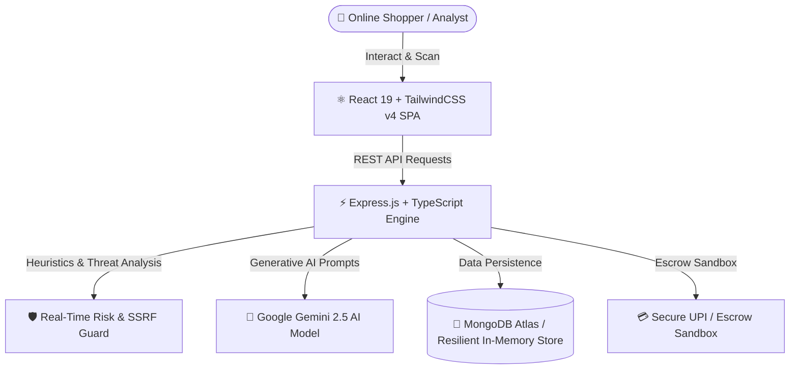

# 🛡️ SafeCart — E-Commerce Fraud Detection & Consumer Safety Platform

<div align="center">


[](https://reactjs.org/)
[](https://www.typescriptlang.org/)
[](https://tailwindcss.com/)
[](https://nodejs.org/)
[](https://ai.google.dev/)
[](https://www.mongodb.com/)
[](LICENSE)

<p align="center">
  <b>SafeCart</b> is an intelligent, AI-powered cybersecurity & fraud-prevention ecosystem designed to protect online shoppers and merchants from fake shopping websites, phishing scams, social media fraud, and fraudulent payment gateways.
</p>

[✨ Live Demo](#-quick-start) • [🚀 Key Features](#-core-features--use-cases) • [🛠️ Architecture](#-system-architecture--tech-stack) • [📖 API Reference](#-backend-api-routes) • [🛡️ Security](#-security--guardrails)

---

</div>

## 📌 Problem Statement & Overview

In today's digital shopping era, consumers lose billions annually to counterfeit e-commerce stores, fraudulent social media ads, fake flash sale domains, and phishing gateways. 

**SafeCart was built to provide an all-in-one defense shield:**
- 🔍 **Instant Domain Verification:** Evaluates trust signals, SSL health, DNS records, and domain age in real-time.
- 🤖 **AI-Powered Threat Detection:** Leverages **Google Gemini AI** to inspect suspicious promotional messages, scam offers, and voice reports.
- 📱 **Social Commerce Defense:** Protects users against fraudulent Instagram shops and fake WhatsApp business numbers.
- 💳 **Protected Checkout & Escrow Sandbox:** Simulates a secure escrow payment sandbox with instant refund guarantees.

---

## 🌟 Core Features & Use Cases

### 1. 🌐 Real-Time URL & Domain Risk Scanner
- **Domain Age & WHOIS Inspection:** Flags newly registered domains often created for quick seasonal scams.
- **Phishing & Typosquatting Guard:** Automatically identifies subtle brand name misspellings (e.g., `amaz0n-deal.xyz`).
- **Dynamic Risk Gauge:** Computes a composite **0–100 Risk Score** categorized into **Safe**, **Suspicious**, and **Dangerous** states.

### 2. 🤖 Gemini AI Cybersecurity Assistant
- **AI Fraud Auditor:** Deciphers suspicious SMS messages, phishing emails, and urgent scam triggers.
- **Multilingual Fraud Advisor:** Interactive 24/7 AI chatbot assisting users in English, Tamil, and other languages.
- **Voice Scam Reporting:** Allows victims to record scam complaints by voice; the system transcribes and audits the audio automatically.

### 3. 📸 Social Media Scam Hunter (Instagram & WhatsApp)
- **Instagram Store Analyzer:** Identifies red flags such as frequent handle changes, disabled comments, and fake follower ratios.
- **WhatsApp Fraud Verifier:** Cross-checks contact numbers against known malicious seller databases.

### 4. 🔒 GPay UPI Escrow & Demo Payment Sandbox
- Simulates an escrow-based secure checkout where payments are safely held until product delivery confirmation.
- Includes virtual VPA validation and an automated dispute/refund simulator.

### 5. 👥 Community Scam Reporting & Admin Dashboard
- Crowdsourced community incident reporting with verification mechanisms.
- Comprehensive administrative control panel with threat moderation, real-time analytics, and audit trails.

---

## 🏗️ System Architecture & Tech Stack



### 💻 Technologies Used:
| Layer | Technologies |
|---|---|
| **Frontend** | React 19, TypeScript, Tailwind CSS v4, Lucide Icons, Recharts, Framer Motion |
| **Backend** | Node.js, Express.js, TypeScript, TSX |
| **Artificial Intelligence** | `@google/genai` (Google Gemini 2.5 Flash API) |
| **Database** | MongoDB Atlas with Mongoose/Native Driver + Resilient In-Memory Fallback |
| **Security & Utilities** | Helmet.js, SSRF Protection Guard, Rate Limiting, JWT Auth, Bcrypt.js, Zod |

---

## 🚀 Quick Start (Run Locally)

### 1. Clone the Repository:
```bash
git clone https://github.com/deepika84284-ship-it/safe.git
cd safe
```

### 2. Install Dependencies:
```bash
npm install
```

### 3. Setup Environment Variables:
Create or edit your `.env` file in the root directory:
```env
PORT=3000
NODE_ENV="development"
MONGODB_URI="mongodb+srv://<username>:<password>@cluster0.mongodb.net/safecart"
JWT_SECRET="your_secure_jwt_secret_key"
GEMINI_API_KEY="your_google_gemini_api_key"
CLIENT_URL="http://localhost:5173"
APP_URL="http://localhost:3000"
```

### 4. Start the Application:
```bash
npm run dev
```

Open your browser and navigate to **`http://localhost:3000`** to experience SafeCart!

---

## 📡 Backend API Routes

| Method | Endpoint | Description |
|---|---|---|
| `GET` | `/api/health` | Service health status & engine uptime |
| `POST` | `/api/auth/register` | User signup with secure password hashing |
| `POST` | `/api/auth/login` | User login and JWT authentication token generation |
| `POST` | `/api/scans` | Analyze website domain URL & calculate Risk Score |
| `GET` | `/api/scans/history` | Retrieve user scan history and verdicts |
| `POST` | `/api/ai/chat` | Interact with Gemini AI Fraud Consultant |
| `POST` | `/api/ai/analyze-message` | Analyze suspicious SMS and phishing messages |
| `POST` | `/api/social/scan-instagram` | Scan Instagram handle for counterfeit vendor traits |
| `POST` | `/api/social/scan-whatsapp` | Verify suspicious WhatsApp vendor phone numbers |
| `POST` | `/api/reports` | Submit community scam report with evidence |
| `GET` | `/api/safety-tips` | Fetch cybersecurity awareness guides |
| `GET` | `/api/admin/dashboard` | Admin analytics, threats overview & moderation |

---

## 🛡️ Security & Guardrails

- **🛡️ SSRF Guard:** Server-Side Request Forgery prevention blocks requests to private IPv4/IPv6 ranges and loopback interfaces.
- **⚡ Rate Limiting:** IP-based throttling protects all public scan endpoints against denial-of-service abuse.
- **🔒 Password Hashing & JWT:** Implements `bcryptjs` (salt rounds: 10) and secure JSON Web Tokens with expiry enforcement.
- **🛡️ HTTP Security Headers:** Pre-configured with `helmet` to mitigate XSS, Clickjacking, and MIME sniffing attacks.

---

## 👥 Contributors & Credits

- **Deepika** — *Lead Developer & Architect* ([GitHub Profile](https://github.com/deepika84284-ship-it))
- Built with ❤️ to ensure safer digital shopping for everyone.

---

<div align="center">
  <b>⭐ Star this repository on GitHub if you find SafeCart helpful! ⭐</b>
</div>