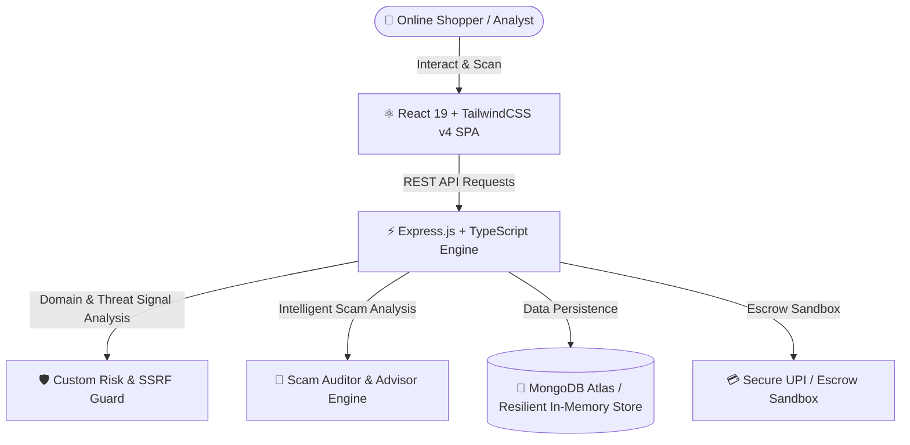

# 🛡️ SafeCart — E-Commerce Fraud Detection & Consumer Safety Platform

<div align="center">


[](https://reactjs.org/)
[](https://www.typescriptlang.org/)
[](https://tailwindcss.com/)
[](https://nodejs.org/)
[](https://www.mongodb.com/)
[](LICENSE)

<p align="center">
  <b>SafeCart</b> is a comprehensive cybersecurity & e-commerce fraud prevention platform designed from scratch to protect online shoppers and merchants from fake shopping websites, phishing scams, social media fraud, and malicious payment gateways.
</p>

[✨ Quick Start](#-quick-start-run-locally) • [🚀 Core Features](#-core-features--implementation) • [🛠️ Architecture](#-system-architecture--tech-stack) • [📖 API Reference](#-backend-api-routes) • [🛡️ Security](#-security--guardrails)

---

</div>

## 📌 Project Overview & Purpose

Online shopping scams, fake e-commerce stores, fraudulent social media ads, and phishing payment links cause immense financial losses to consumers every day.

**SafeCart was engineered as an all-in-one defense platform to tackle this:**
- 🔍 **Real-Time Website Risk Analysis:** Evaluates domain age, SSL certificate validity, DNS records, and brand spoofing heuristics.
- 💬 **Intelligent Scam Auditor & Assistant:** Audits suspicious SMS/texts, promotional scam messages, and voice complaints with tailored guidance.
- 📱 **Social Commerce Defense:** Protects users by analyzing suspicious Instagram shops and verifying WhatsApp business seller numbers.
- 💳 **Protected Checkout & Escrow Sandbox:** Provides an escrow simulation workflow that safeguards buyer funds until confirmed delivery.

---

## 🌟 Core Features & Implementation

### 1. 🌐 Real-Time URL & Domain Risk Engine
- **Domain Age & WHOIS Analysis:** Automatically flags newly registered domains created for short-lived scams.
- **Phishing & Typosquatting Guard:** Detects subtle character variations and spoofed brand domains (e.g., `amaz0n-deal.xyz`).
- **Dynamic Risk Gauge:** Computes a composite **0–100 Risk Score** categorized into **Safe**, **Suspicious**, and **Dangerous** ratings.

### 2. 🛡️ Intelligent Fraud Assistant & Message Auditor
- **Scam Message Auditor:** Scans suspicious SMS, urgent prize notices, and phishing emails for red flags.
- **Multi-Language Interactive Assistant:** Provides real-time guidance and answers consumer doubts in English and Tamil.
- **Voice Scam Incident Recorder:** Allows users to record voice complaints directly; the platform transcribes and evaluates the incident.

### 3. 📸 Social Media Scam Hunter (Instagram & WhatsApp)
- **Instagram Store Analyzer:** Detects red flags such as frequent account name changes, disabled comments, and unnatural engagement ratios.
- **WhatsApp Fraud Verifier:** Cross-checks phone numbers against known fraudulent seller patterns and history.

### 4. 🔒 GPay UPI Escrow & Demo Payment Sandbox
- Simulates an escrow-based secure payment flow where money is held securely until package delivery verification.
- Includes virtual VPA validation and an automated dispute/refund simulator.

### 5. 👥 Community Scam Reporting & Admin Dashboard
- Crowdsourced incident reporting system with community feedback loops.
- Centralized administrative dashboard for reviewing reported threats, updating website safety verdicts, and viewing audit logs.

---

## 🏗️ System Architecture & Tech Stack



### 💻 Technologies Used:
| Layer | Technologies |
|---|---|
| **Frontend** | React 19, TypeScript, Tailwind CSS v4, Lucide Icons, Recharts, Framer Motion |
| **Backend** | Node.js, Express.js, TypeScript, TSX |
| **Database** | MongoDB Atlas (Native Driver) + Resilient In-Memory Storage Engine |
| **Security & Utilities** | Helmet.js, SSRF Protection Guard, Rate Limiting, JWT Auth, Bcrypt.js, Zod |

---

## 🚀 Quick Start (Run Locally)

### 1. Clone the Repository:
```bash
git clone https://github.com/deepika84284-ship-it/safe.git
cd safe
```

### 2. Install Dependencies:
```bash
npm install
```

### 3. Setup Environment Variables:
Create a `.env` file in the project root directory:
```env
PORT=3000
NODE_ENV="development"
MONGODB_URI="mongodb+srv://<username>:<password>@cluster0.mongodb.net/safecart"
JWT_SECRET="your_secure_jwt_secret_key"
CLIENT_URL="http://localhost:5173"
APP_URL="http://localhost:3000"
```

### 4. Start the Application:
```bash
npm run dev
```

Open your browser and navigate to **`http://localhost:3000`** to run SafeCart locally.

---

## 📡 Backend API Routes

| Method | Endpoint | Description |
|---|---|---|
| `GET` | `/api/health` | Engine health status & uptime |
| `POST` | `/api/auth/register` | User signup with secure password hashing |
| `POST` | `/api/auth/login` | User login and JWT authentication token generation |
| `POST` | `/api/scans` | Analyze website domain URL & calculate Risk Score |
| `GET` | `/api/scans/history` | Retrieve user scan history and verdicts |
| `POST` | `/api/ai/chat` | Fraud advice & assistant consultation endpoint |
| `POST` | `/api/ai/analyze-message` | Analyze suspicious SMS and phishing messages |
| `POST` | `/api/social/scan-instagram` | Scan Instagram handle for counterfeit vendor traits |
| `POST` | `/api/social/scan-whatsapp` | Verify suspicious WhatsApp vendor phone numbers |
| `POST` | `/api/reports` | Submit community scam report with evidence |
| `GET` | `/api/safety-tips` | Fetch cybersecurity awareness guides |
| `GET` | `/api/admin/dashboard` | Admin analytics, threats overview & moderation |

---

## 🛡️ Security & Guardrails

- **🛡️ SSRF Guard:** Built-in Server-Side Request Forgery prevention that blocks access to internal network IP ranges.
- **⚡ Rate Limiting:** Custom IP-based throttling protects public scan endpoints against brute force and denial-of-service abuse.
- **🔒 Password Security & JWT:** Implements `bcryptjs` with salted hashing and standard JSON Web Token expiry validation.
- **🛡️ HTTP Security Headers:** Configured with `helmet` for defense against XSS, clickjacking, and MIME sniffing attacks.

---

## 👥 Authors & Credits

- **Deepika** — *Lead Developer & Platform Architect* ([GitHub Profile](https://github.com/deepika84284-ship-it))
- Built to provide safer digital commerce and fraud protection for everyone.

---

<div align="center">
  <b>⭐ Star this repository on GitHub if you find SafeCart helpful! ⭐</b>
</div>